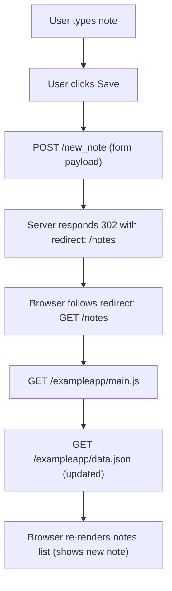

```mermaid
flowchart TD
    A["User types note"] --> B["User clicks Save"]
    B --> C["POST /new_note (form payload)"]
    C --> D["Server responds 302 with redirect: /notes"]
    D --> E["Browser follows redirect: GET /notes"]
    E --> F["GET /exampleapp/main.js"]
    F --> G["GET /exampleapp/data.json (updated)"]
    G --> H["Browser re‑renders notes list (shows new note)"]
```
