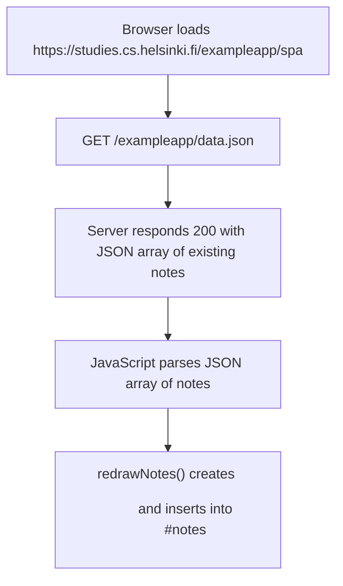

```mermaid
flowchart TD
    A["Browser loads https://studies.cs.helsinki.fi/exampleapp/spa"]
    A --> B["GET /exampleapp/data.json"]
    B --> C["Server responds 200 with JSON array of existing notes"]
    C --> D["JavaScript parses JSON array of notes"]
    D --> E["redrawNotes() creates <ul class='notes'> and inserts into #notes"]
```
